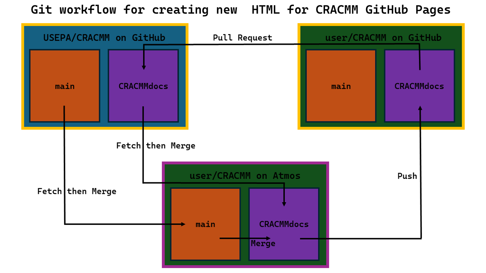

# Sphinx Usage in the CRACMM Repository
This page provides documentation for the process of using Sphinx to build HTML for the CRACMM website. It is primarily intended for CRACMM developers at the EPA. Others may or may not find the information presented here useful.

[Sphinx](https://www.sphinx-doc.org/en/master/) is a software written in Python that is used to create HTML files based on already existing files. It is typically used to create websites that document software and it can be used in combination with GitHub's [Pages](https://pages.github.com/) utility to publish a website based on a GitHub repository. This page explains how Sphinx is used to create a GitHub site for the CRACMM repository using Sphinx.

To view this page on on the CRACMM website instead of in raw markdown (if you're not already there), click [here](https://USEPA.github.io/CRACMM/sphinx/README.html).


## Table of Contents
* [Git Workflow Summary](#git-workflow-summary): This section goes over the basic git workflow for updating HTML on the CRACMM GitHub Pages website. If you are looking for detailed instructions on this process, this is not the tutorial you are looking for. Use the "Repository Setup" and "Process to Build HTML" tutorials instead.

* [Environment Setup](#environment-setup): This section provides instructions on how to create a Python environment designed to run Sphinx on the CRACMM repository.

* [Repository Setup](#repository-setup): This section provides instructions on how to get your personal fork of the CRACMM repository ready to build HTML for the CRACMM website, even if you dont have a fork yet!

* [Process to Build HTML](#process-to-build-html): This section is for people who have a Python environment designed to run Sphinx on the CRACMM repository and provides instructions on how to update the HTML for the CRACMM GitHub pages site based on updates to the main branch.

* [HTML Build Script Description](#file-description-run_buildcsh): This section describes the purpose of the `run_build.csh` file and explains what each command in the file does and why it is needed.

* [Sphinx Configuration Description](#file-description-confpy): This section describes the contents of `conf.py` which provides Sphinx with a variety of user option that define how the HTML is produced.

* [Website Landing Page Description](#file-description-indexmd): This section describes the contents of `index.md` which serves as the website landing page and describes how to maintain it so that it always functions as a landing page.

* [Website Global Navbar File](#file-description-toctreetxt): This file stores the table of contents tree (often refered to as "toctree" among Sphinx users), which arranges the left navbar on every page of the website.

* [Helpful Resources](#helpful-resources): This section provides links to other websites that have good instructions and tips on how to set up and improve a GitHub Pages site using Sphinx. Many of these websites are also linked in other locations around the page in addition to in the Helpful Resources section.


## Git Workflow Summary


1. On Atmos, fetch and then merge the latest version of USEPA/CRACMM/CRACMMdocs into your local user/CRACMM/CRACMMdocs branch. Then perform the same set of actions for the user/CRACMM/main branch. 

2. On your local CRACMM repository on Atmos, merge the main branch into the CRACMMdocs branch.

3. Build new HTML using Sphinx in the CRACMMdocs branch.

4. Push the new version of the CRACMMdocs branch (with the new HTML) from your local CRACMM repository on Atmos to your remote repository on GitHub. Make sure to push to user/CRACMM/CRACMMdocs.

5. Submit a pull request on GitHub from user/CRACMM/CRACMMdocs, which contains the new HTML, to USEPA/CRACMM/CRACMMdocs.

To return to the Table of Contents, click [here](#table-of-contents).


## Environment setup
If you have never run Sphinx for CRACMM before, you are going to need to set up a new python environment to make sure everything works correctly. The following steps explain how to set up the environment:

1. To make sure Sphinx works properly, you need to make sure you have the correct Python version running. Version 3.11.11 is suggested for this task because it works with all packages that will need to be installed. It is likely that other versions will work as well but some may cause compataibility issues with the required packages. To use Python 3.11.11, enter the command:
    ```
    module load python/3.11
    ```
    To make sure the version is set correctly, you can check your current version by running:
    ```
    python --version
    ```

2. Once the Python version has been set, it is time to create the new environment. You can give the environment any name you like. For example: `cracmm_docs_env`. Run the following command:
    ```
    python -m venv ./cracmm_docs_env
    ```
    Then, to activate the environment, enter the command:
    ```
    source cracmm_docs_env/bin/activate.csh
    ```
    You should now see `(cracmm_docs_env)` appear to the left of your LAN ID on the command line. This indicates that the environment has been activated. If you ever need to deactivate the enviroment, enter:
    ```
    deactivate cracmm_docs_env
    ```

3.  Next, some Python packages need to be installed so that HTML for the CRACMM website can be produced correctly. Enter the following series of commands to install all necessary packages (the version number of each package used at time of writing is included in the comments after each line):
    ```
    pip install --upgrade pip           #25.0.1
    pip install sphinx                  #8.2.3
    pip install sphinx_rtd_theme        #3.0.2
    pip install myst_nb                 #1.2.0
    pip install sphinx-new-tab-link     #0.7.0
    ```
    Description of each installed package:
    * [sphinx](https://www.sphinx-doc.org/en/master/) is the software needed to generate the HTML from the files already existing in the CRACMM repository.

    * [sphinx_rtd_theme](https://sphinx-rtd-theme.readthedocs.io/en/stable/) is a package that acts as a Sphinx extension responsible for the overall website design. Other theme extensions could be downloaded to change website appearance. Some theme extensions come pre-installed with Sphinx.

    * [myst_nb](https://myst-nb.readthedocs.io/en/latest/) is a package that acts as a Sphinx extenion. It is based on [myst_parser](https://myst-parser.readthedocs.io/en/latest/) and allows markdown and Jupyter Notebook files to be interpreted by Sphinx so that HTML can be generated based on these files.

    * [sphinx-new-tab-link](https://github.com/ftnext/sphinx-new-tab-link/tree/main) is a package that acts as a Sphinx extension. It allows all external links within Sphinx docuentation to open in a new tab instead of overwriting the current tab.
    
    Once these installations are complete, your Python environment should now be set up to run Sphinx correctly on the CRACMM repository! If your fork of the CRACMM repository on Atmos is not up to date with the latest version, continue to the [next section](#repository-setup) before learning how to build HTML. If you are ready to build HTML, click [here](#process-to-build-html) to learn how.

To return to the Table of Contents, click [here](#table-of-contents).


## Repository Setup
If you do not have a fully updated fork of the USEPA/CRACMM repository with all the latest changes, and you would like to update one or more of the HTML pages on the CRACMM website, follow the steps below.

1. In the case that you do not have a personal fork of the repository at all, make a fork on GitHub now. Then, clone your fork of the GitHub repository to Atmos using the following commands (these commands assume your fork of CRACMM is called "CRACMM"):
    ```
    cd <path of directory for repository storage>
    git clone https://github.com/<GitHub username>/CRACMM.git
    cd CRACMM
    ```
    You should now be in the root directory of your remote fork of the CRACMM repository.

2. Next, once you are in your repository on Atmos, you need to make sure that all branches are up to date, not just `main`. To do this, enter the following commands:
    ```
    git remote add epacracmm_repo git@github.com:USEPA/CRACMM.git
    git fetch epacracmm_repo
    git switch main
    git merge epacracmm_repo/main
    git switch CRACMMdocs
    #if there is no branch called "CRACMMdocs" yet, try this:
    git switch -c CRACMMdocs
    git merge epacracmm_repo/CRACMMdocs
    ```
    Your main and CRACMMdocs branches should now be identical to that of USEPA/CRACMM.

3. (Optional step. Skip to the next step if you are not making changes to the repository other than the HTML update.) Feel free to make changes to any file on either `main` or `CRACMMdocs`. However, for files that are on both branches, DO NOT make changes to the version of the file on `CRACMMdocs`. ONLY make changes to these files on `main`, otherwise merge conflicts may arise later.  make sure to `commit` those changes before moving on to the next step by running the commands:
    ```
    git add --all
    git commit
    ```
    Then add the desired commit message. 
    
    If any changes are made to files on the `CRACMMdocs` branch, you may need to update somthing somewhere in this readme file. Please make the necessary updates if there are any relavent changes. Changes to `CRACMMdocs` can be commited after the HTML is built.

4. Once the `main` branch of the repository is up to date with all the changes you would like to include on the website, you also need to make the updates appear on the `CRACMMdocs` branch. To replicate the changes made to `main` on `CRACMMdocs`, enter the commands:
    ```
    git switch CRACMMdocs
    git merge main
    ```

If you still would like to update the CRACMM website's HTML and you already have a Python environment set up to run Sphinx, continue to the [next section](#process-to-build-html) to prepare your Python environment. Otherwise, click [here](#environment-setup) to learn how to set up the Python environment.


## Process to Build HTML
The steps to produce HTML for the CRACMM GitHub Pages site are explained below. These instructions assume that you already have a personal fork of the CRACMM repository that is up to date with the lastest version of all files within the repository. If you do not, click [here](#repository-setup). 

When changes are made to the main branch of the CRACMM repository, new HTML will need to be generated in order to stay up to date with the latest version. This is true regardless of whether the changes are made to markdown files used for documentation, or any file that could be downloaded directly via link anywhere on the website. In other words, HTML should ALWAYS be rebuilt every time a change is made to a file within the repository, regardless of how small of a change it is. Of course, this is only true of when you would would like the changes to propgate to the website for the user to see.   

1. Starting in your home directory (`~/`) on Atmos, activate your environment for running Sphinx on the CRACMM repository by using the command:  
    ```
    source <name of environment>/bin/activate.csh  
    ```
    If you do not have such environment set up, click [here](#environment-setup) to learn how to set one up.  

2. `cd` to the root directory of your local fork of the CRACMM repository. It is important that you use your personal fork of the repository instead of the USEPA/CRACMM repository. Once you are in the root directory, make sure you are in the `CRACMMdocs` branch by entering the command:
    ```
    git switch CRACMMdocs
    ```

3. Before HTML can be built properly using Sphinx, it is important that the Sphinx working path is set correctly. To do this, open up the file `conf.py`. In the top section of the file, right before the "Project inormation" section, there should be a line that looks somthing like this:
    ```
    sys.path.insert(1, '<path to a directory>')
    ```
    Replace the path included in the parentheses with the absolute path of the root directory of your local CRACMM repository. Then, save the file and return to the command line. For more information on the purpose of this line, click [here](#path-setting).

4. Next, enter the `sphinx` directory by entering the command: 
    ```
    cd sphinx
    ```

5. Now its time to build the HTML for the website! To do this, run the command: 
    ```
    ./run_build.csh
    ```
    Once the process is complete, you should have your updated HTML in the docs folder of the repository!

    * This c-shell script runs a series of commands that prepares the repository for the HTML building, builds the HTML using the `sphinx-build` command, and runs another series of commands that cleans up the repository after the build process is complete. For more information on each command within the script, click [here](#file-description-run_buildcsh).

    * When running this script, be aware that you may recieve several build warnings from Sphinx. Hopefully, none of them will indicate an issue with the website, but depending on the nature of the updates that were made, these may indicate a problem. With the state of the website at the time of writing, 5-20 build warnings is normal and should not mean that there is a problem. Sometimes, the number of warnings can vary even if no change has been made, so be aware that the warnings are not always consistant. Also, the number of warnings that can generally be considered "safe" (not indicating an issue) will likely change as the website develops with time. Therefore, always check the warnings to see whether they may represent an issue with the website. At the time of writing, there are typically several types of build warnings that cause no issue for the website. These are:
        * "ERROR: Document may not begin with a transition. [docutils]"

        * "ERROR: Document may not end with a transition. [docutils]"

        * "WARNING: document isn't included in any toctree [toc.not_included]"

        * "WARNING: 'myst' cross-reference target not found: '' [myst.xref_missing]"

        Although these warnings appear muiltiple times each during the build process, none are a sign of a real issue in the website.

    * You also may recieve a few warnings from the `rm` command saying that certain files or directories could not be removed. These do not indicate any issues with the build process and can be ignored.

    * If you have not run the `run_build.csh` script before, you may need to change the file access permissions by entering the command:
        ```
        chmod u+x run_build.csh
        ```

    * Sometimes, if you have not closed your session on Atmos since installing Sphinx in your Python environment, there is a possibility you will need to restart your session for the `sphinx-build` command to work. This should only be an issue the first time a Sphinx command is run within a Python environment.

6. Commit the new HTML to the repository by running the commands:
    ```
    git add --all
    git commit
    ```
    Then write the desired commit message.

7. Once the changes have been commited, `push` the new version of the local `CRACMMdocs` branch with the updated HTML up to the remote CRACMM repository on GitHub using the command:
    ```
    git push -u origin CRACMMdocs
    ```
    Note that the use of `origin` here should be a reference to your personal fork of the CRACMM repository on GitHub beacuse all of this work should be done on your fork of the repository. 
    
    Then, if you made changes to the `main` branch, make sure to `push` the new version of `main` to GitHub as well. Run the commands:
    ```
    git switch main
    git push -u origin main
    ```

8. Finally, go back to your remote fork of the CRACMM repository on GitHub. It should now look identical to your local fork on Atmos with all changes included.  
    
    First, submit a pull request from your `CRACMMdocs` branch, with the updated HTML, to the `CRACMMdocs` branch of the USEPA/CRACMM repository. Once this pull request is approved, you will have officially updated the CRACMM documentation!

    Then, if you made updates to the `main` branch, submit a pull request from your `main` branch, with your changes, to the `main` branch of the USEPA/CRACMM repository.

To return to the Table of Contents, click [here](#table-of-contents).


## File Description: run_build.csh
When building HTML using Sphinx for the CRACMM repository, there are commands that are desireable to run before and after the `sphinx-build` command (the command that actually generates HTML) every time HTML is built. To save the user time, this c-shell script has been created to run the entire list of commands necessary to accurately produce HTML for the CRACMM repository and minimize sphinx-build warnings. A description of the purpose of each line is included below. It is also important to note that this file should always be run from the `sphinx` directory, otherwise it will not function correctly and HTML might not be produced.

To view `run_build.csh` on GitHub, click [here](https://github.com/USEPA/CRACMM/blob/CRACMMdocs/sphinx/run_build.csh).

### `rm -r ../docs/*`
Cleans out the directory where HTML documentation is stored to guarantee a fresh start on the HTML every time `run_build.csh` is run.

### `mkdir ../_static`
Prevents a build warning related to there not being a `_static` directory when running the sphinx-build command. this does not affect the resulting HTML in any way, it simply removes the warning.

### `mkdir ../utilities/output`
Creates a directory for Jupyter Notebook output files to be temporarily stored while the notebooks are executed during the `sphinx-build` command. The files put here are not needed and this directory is deleted after the `sphinx-build` command is completed.

### `cp ../index.md ../index_duplicate.md`    
Makes a duplicate of `index.md` called `index_duplicate.md`. The duplicate that is created does not contain the Sphinx `toctree` directives that are added by the next command to `index.md`. `index_duplicate.md` is included in the main `toctree` of `index.md`, allowing the user to access a copy of the landing page from the left navbar. There may be other ways of adding the landing page to the main `toctree`, but this seemed like a simple solution.

### `python3 python_scripts/add_toctree.py`
This script takes the original `index.md` file and adds a series of Sphinx `toctree` directives to the bottom of it. This serves as the global navbar for the website. It adds the `toctree` directives from the file `toctree.txt`, which stores the `toctree` information so that `index.md` dosent have to. This allows `index.md` to appear as a regular markdown file while in the GitHub repository, but it can live up to its full potential of defining the global navbar on the website.

### `sphinx-build .. ../docs`    
Builds HTML files based on markdown files. This is where Sphinx actually operates on the CRACMM repository. It takes input from the root directory of the repsoitory (hense the `..`, which is the relative path to the root directory from the `sphinx` directory) and produces output HTML files in the docs directory (hense the `../docs`, which is the relative path to the `docs` directory from the `sphinx` directory). For more information on the `sphinx-build` command, click [here](https://www.sphinx-doc.org/en/master/usage/quickstart.html#running-the-build).

### `python3 python_scripts/delete_toctree.py`
This script overwrites index.md and does not add the `toctree` directives back into it so it can just be a regular markdown file in the GitHub repository. No ugly Sphinx directives on CRACMM's markdown!

### `touch ../docs/.nojekyll`
Creates a `.nojekyll` file in the `docs` directory. This is an empty file that tells GitHub Pages that all the HTML styling has been done already and it does not need to go through extra steps to format to jekyll style. If this file is not added to the `docs` directory, the website styling created by Sphinx will not function. 

### `rm -r  jupyter_execute`
Removes files created when running the Jupyter Notebooks that are not necessary. This line may cause an error related to there being no file or directory called `jupyter_execute`, this error can be ignored.

### `rm -r ../jupyter_execute`
Removes files created when running the Jupyter Notebooks that are not necessary. This line may cause an error related to there being no file or directory called `../jupyter_execute`, this error can be ignored.

### `rm -r ../_static`
Removes the `../_static` folder which is not needed in the final output. Click [here](#mkdir-_static) for more details on the purpose of this directory.

### `rm -r ../utilities/output`
Removes output files created by the code in the Jupyter Notebooks that are not necessary. Click [here](#mkdir-utilitiesoutput) for more details on the purpose of this directory.

### `rm ../index_duplicate.md`
Removes the duplicate copy of `index.md`, which is not needed for the GitHub repository. Click [here](#python3-duplicate_indexpy) for more details on the purpose of this file.

### `rm ../docs/.doctrees/environment.pickle`
`environment.pickle` is created by the `sphinx-build` command and ends up in the `docs/.doctree` directory. `.pickle` files are executable code and can cause security issues when shared with others. This file is deleted to make sure it does not get shared with others. If other `.pickle` files are found, please add another line similar to this one to prevent these additional files from being shared with the public.

To return to the Table of Contents, click [here](#table-of-contents).


## File Description: conf.py
`conf.py` is a Sphinx generated file produced by the `sphinx-quickstart` command which initializes a Sphinx project (click [here](https://youtu.be/nZttMg_n_s0?si=WYa8G39MyPvoh20w&t=219) to watch a video about what the `sphinx-quickstart` command does). The file is responsible for providing Sphinx with important information about how to configure and create your HTML. The file has four different sections, each serving a diferent purpose. For additional information about `conf.py` and all the variables that could be added to it, click [here](https://www.sphinx-doc.org/en/master/usage/configuration.html).

It should also be noted that the file location of `conf.py` is extremely important. Make sure to keep it in the root directory of the repository. Otherwise, it will interfere with the commands set up in [run_build.csh](#file-description-run_buildcsh).  

To view `conf.py` on GitHub, click [here](https://github.com/USEPA/CRACMM/blob/CRACMMdocs/conf.py).

### Path Setting
The first section is not titled and comes before the section titled "Project Information". At the bottom of this section (right above the Project Information section), there are two lines of Python code. These lines are:
```    
import sys
sys.path.insert(1, '/path/to/local/CRACMM/repository')
``` 
The purpose of these lines is to include the path of the root directory of your local CRACMM repository in the Python system path. This allows Sphinx to use this path as a base to generate the website from. In other words, Sphinx will only make HTML based on files within this directory and the files in its sub-directories. Make sure this path is set correctly, otherwise you may come across several issues. 

### Project Information
In the Project Information section, there are four string variables. These are all based on the `sphinx-quickstart` prompt inputs. If necessary, these can be changed to update responses to the prompts and the results of those changes will carry forward throughout the project. At the time of writing, these lines looked like this:
```
project = 'CRACMM'
copyright = 'CRACMM does not have copyright'
author = 'U.S. Environmental Protection Agency'
release = '2.0'
```
In this case, the `copyright` variable is set to `'CRACMM does not have copyright'` because the US government cannot copyright any of its products. Although this should not change anything on the page, it acts as a placeholder to make it clear that there is no copyright in case a copyright message accidentally shows up somewhere.

### General Configuration
The General configuration section is an important part of `conf.py`. By default, after running `sphinx-quickstart`, the section looks like this:
```
extensions = []

templates_path = ['_templates']
exclude_patterns = ['_build', 'Thumbs.db', '.DS_Store']
```
The extensions list is where all the Sphinx extensions are added to the project so that the resulting HTML can be produced in the desired way. For example, if you would like to make HTML files from markdown files, you will need to add an extension. There are many extension options across the internet and some that are built-in when Sphinx is downloaded. For the state of the CRACMM website at the time of writing, there are only two extensions needed and, thus, the list looks like this: 
```
extensions = ['myst_nb', 'sphinx_new_tab_link']
```
None of the other default lines in this section were altered from their original state (the `templates_path` and `exclude_patterns` variables). However, three new lines were added to the section:
```
myst_enable_extensions = ['dollarmath']
myst_heading_anchors = 4    
new_tab_link_show_external_link_icon = True
```
* The first variable that was added, `myst_enable_extensions`, allows extensions to be added to the `myst_nb` extension. In this case, the `dollarmath` extension was added, allowing LaTeX code in markdown and Jupyter Notebook files to format correctly when the HTML is produced.

* The `myst_heading_anchors` variable resolves build warnings regarding myst not finding target IDs when linking to markdown headings. The value of the variable indicates the lowest level heading that Sphinx will link to. However, even if a link is made to a lower level heading that what is indicated by `myst_heading_anchors`, the link should still work, but it may cause a build warning.

* Finally, the variable `new_tab_link_show_external_link_icon` is a part of the `sphinx-new-tab-link` extension. When set to true (as it currently is) It tells Sphinx to add an icon at the end of every external link across the website.

There are many other variables that can be added to this section that are built-in with Sphinx and many more that are connected to the Sphinx extensions that can be installed by adding them to the `extensions` list. As the website develops further, remember that there are many possibilities here.

### Options for HTML Output
The last section of `conf.py` is the "Options for HTML Output" section. This section contains a few variables that influence the appearance of the HTML that is produced by Sphinx. When produced by `sphinx-quickstart` at project initalization, the section looks like this:
```
html_theme = 'alabaster'
html_static_path = ['_static']
```
* The `html_theme` variable tells Sphinx how to arrange the website HTML. It governs the overall appearance of the site. There are several built-in themes that come with Sphinx and others that can be installed in your Python environment.

* The `html_static_path` variable does some sort of path setting where it tells Sphinx where to look for static images. However, this variable was left alone and, for that reason, it is a little unclear exactly how it functions.

After making some changes to this section for the CRACMM repository, the Options for HTML Output section now looked like this at the time of writing:
```
html_theme = 'sphinx_rtd_theme'
html_static_path = ['_static']
html_logo = 'logos/CRACMM_1.png'
html_show_copyright = False
```
* The `html_theme` variable has been changed from `'alabaster'` to `'sphinx_rtd_theme'`. The "rtd" stands for "Read the Docs", which is another software documentation website hosting service similar to GitHub Pages. This theme is the theme used by all Read the Docs pages.

* As stated previously, the `html_static_path` variable remains unchanged from its default state.

* The `html_logo` variable is an added variable that is built-in with Sphinx and it sets the path to an image that is included in the upper left corner of the website above the site's search bar. in this case, it adds the CRACMM logo to the page.

* Lastly, the `html_show_copyright` variable tells Sphinx whether or not to put copyright information at the bottom of the page. When set to `True` (the default setting), the copyright information appears on the footter of every page. when set to `False`, like it is now for CRACMM, this information does not appear. The reason for adding this variable is because the US Government cannot copyright any of its products, so having copyright information here would not be accurate.

Just like with the General Configuration section, there are many other variables that can be added to the Options for HTML Output section that are built-in with Sphinx and many more that are connected to the Sphinx extensions that can be installed by adding them to the `extensions` list. As the website develops further, remember that there are many possibilities here.

To return to the Table of Contents, click [here](#table-of-contents).


## File Description: index.md
The file `index.md` organizes the landing page of the website. When Sphinx is run, it takes `index.md` and uses it to create a file in the docs directory called `index.html`. When Github Pages sees the `index.html` file, it automatically recognizes the name and sets it to be the landing page for the website. Therefore, it is extremely important that the name of `index.md` does not change. This is also true of the file location, it needs to stay in the root directory of the repository for GitHub Pages to find `index.html`. In addition, all changes made to this file should be made in the `main` branch, do not make changes in the `CRACMMdocs` branch. 

To view `index.md` on GitHub, click [here](https://github.com/USEPA/CRACMM/blob/CRACMMdocs/conf.py).

To return to the Table of Contents, click [here](#table-of-contents).


## File Description: toctree.txt
`toctree.txt` is responsible for organizing the global table of contents tree (often refered to as "toctree" among Sphinx users) for the website. The contents of the `toctree` directives in `toctree.txt` become the contents of the navbar on the left side of the screen when on the website. `toctree.txt` is actually not a file used by Sphinx. Instead, its contents are added at the bottom of `index.md` by a command in `run_build.csh` (click [here](#python3-python_scriptsadd_toctreepy) for more details on why this process is done) and then removed after the build process by another [command](#python3-python_scriptsdelete_toctreepy). Any updates to the website navbar should be made in `toctree.txt`.

To view `toctree.txt` on GitHub, click [here](https://github.com/USEPA/CRACMM/blob/CRACMMdocs/sphinx/toctree.txt).

The file starts with a section that starts with the following line:
```
```{eval-rst}
```
Once the contents of this file are copied to the bottom of `index.md`, this line indicates to Sphinx that what is below it is ReStrctured Text and not markdown. ReStructured Text is the native text language of Sphinx. This allows Sphinx directives to be included in this part of the markdown file. 

Next is a series of `toctree` Sphinx directives. Each one creates a new section of the website navbar. An example of one of these sections is the "Contents" section, which looks like this:
```
.. toctree::
   :caption: Contents
   :hidden:

   index_duplicate.md
   chemistry/README.md
   emissions/README.md
   metadata/README.md
   logos/logos.md
   boundary_conditions.md
   utilities/README.md
```
* The first line includes ".." which starts a comment in a ReStrctured Text file. Everything that is indented to the same level as the first "t" in `toctree` is included in the comment until text stops sharing that indent level. In this case, since `toctree` is a Sphinx directive, all lines of the code above are part of this particular directive because it is all part of the same comment.

* The next line, `:caption: Contents`, is an option of the `toctree` directive. It simply gives a name to the following list of links to help group navbar items. In this case, the group of links is named "Contents".

* The `:hidden:` option prevents the toctree from being visible at the bottom of the page. That way you dont get a second version of the `toctree` in bullet point format when the HTML is built.

* Afterwards is a blank line follwed by a series of links to other documents. The blank line indicates to Sphinx that there are no more `toctree` options being specified, and the links allow the website user to easily navigate the website. 

You can add new links to any of the listed toctrees by adding a relative link to a markdown or Jupyter Notebook file. When adding links to a `toctree`, make sure to set the links relative to `index.md` and not `run_build.csh`, even though Sphinx is ultimately run from `run_build.csh`. 

You can also add external links to the contents of a `toctree`. To do this, in a new line of the `toctree`, write the text you would like to appear on the navbar, and then in angle brackets, write the link. An example from `index.md` at the time of writing looks like this:
```
CMAQ Documentation <https://usepa.github.io/CMAQ/>
```
On the navbar, only "CMAQ Documentation" is visible. When you click on "CMAQ Documentation" in the navbar, it takes you to [https://usepa.github.io/CMAQ/](https://usepa.github.io/CMAQ/).

To return to the Table of Contents, click [here](#table-of-contents).

## Helpful Resources
### General Software Documentation 
* [Sphinx](https://www.sphinx-doc.org/en/master/): Homepage for Sphinx. Lots of useful deatils across the website describing how to use various Sphinx features.

* [GitHub Pages](https://pages.github.com/): Main page for GitHub Pages help. Gives some simple tutorials on how to get a Pages website up and running and has a "Pages Help" button in the upper right corner for more specific issues. 

* [MyST Parser](https://myst-parser.readthedocs.io/en/latest/): Homepage for MyST Parser. Covers all sorts of functionality of the software throughout the website.

* [MyST NB](https://myst-nb.readthedocs.io/en/latest/): Homepage for MyST NB. Discusses the extra functionality of the Sphinx extension that is not included in the MyST Parser extension.

* [Sphinx New Tab Link](https://github.com/ftnext/sphinx-new-tab-link/tree/main): GitHub page for the `sphinx-new-tab-link` extention. The readme in the root directory is helpful for explaining how to use the extension.

* [Sphinx Read the Docs Theme](https://sphinx-rtd-theme.readthedocs.io/en/stable/): Homepage for details about the `sphinx_rtd_theme`. HTML customization options and other things related to the theme can be found here.

### Task Specific Documentation and tutorials
* [Publishing to GitHub Pages](https://youtu.be/zSZpCrwgVOM?si=XS-v_kxJ4FwPHfOi&t=440): If the website has not yet been published, this YouTube tutorial does a great job explaining how to publish your Sphinx generated HTML using GitHub Pages.

* [Sphinx Directives](https://www.sphinx-doc.org/en/master/usage/restructuredtext/directives.html): Sphinx functionality that exists beyond the ability of markdown files' syntax uses a series of "directives". Normally these would be contained within the comments of a ReStructured Text (rst) file, the native file format of Sphinx. This page details the directive options available if additional directives are desired with development of the website after the time of writing.

* [Built-in Sphinx Extensions](https://www.sphinx-doc.org/en/master/usage/extensions/index.html): This page provides a list of all built-in Sphinx extensions and allows you to navigate to the description of each one. It also describes how ot find other extensions. 

* Staring Fresh with Sphinx: Since the Sphinx project for CRACMM has already been set up, the links below will not likely be useful. However, understaning the basics of how to start a Sphinx project might become handy to some people, especially in the case that a new sphinx project needs to be created. 
    * [Sphinx Getting Started Tutorial](https://www.sphinx-doc.org/en/master/usage/quickstart.html)
    * [YouTube Sphinx Tutorial](https://www.youtube.com/watch?v=nZttMg_n_s0)

To return to the Table of Contents, click [here](#table-of-contents).

---
    author: Michael Pye (pye.michael@epa.gov)
    date: 2025-03-04
---